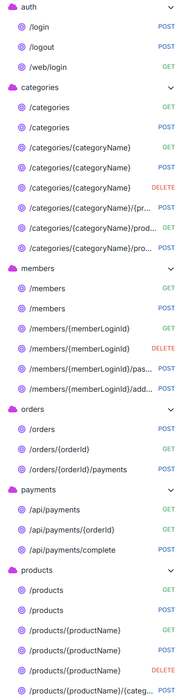

# API 명세

- Auth  
  POST /login 로그인  
  POST /logout 로그아웃  
  GET /web/login 웹 로그인

- Category  
  GET /categories 카테고리 목록 조회  
  POST /categories 카테고리 등록  
  GET /categories/{categoryName} 카테고리 조회  
  POST /categories/{categoryName} 카테고리 수정  
  DELETE /categories/{categoryName} 카테고리 삭제  
  POST /categories/{categoryName}/{productName} 카테고리에 소속된 상품 제거  
  GET /categories/{categoryName}/products 카테고리에 소속된 상품들 조회  
  POST /categories/{categoryName}/products 카테고리에 소속된 상품들 제거

- Member  
  GET /members 회원 목록 조회  
  POST /members 회원 가입  
  GET /members/{memberLoginId} 회원 조회  
  DELETE /members/{memberLoginId} 회원 삭제  
  POST /members/{memberLoginId}/password 회원 비밀번호 수정  
  POST /members/{memberLoginId}/address 회원 주소 수정

- Order  
  POST /orders 주문 생성  
  GET /orders/{orderNumber} 주문 조회  
  POST /orders/{orderNumber} 주문 수정  
  DELETE /orders/{orderNumber} 주문 삭제  
  POST /orders/{orderNumber} 주문 취소  
  POST /orders/{orderNumber}/payments 결제 요청

- Payment  
  GET /api/payments 결제 화면  
  GET /api/payments/{orderNumber} 주문 정보 전달  
  POST /api/payments/complete 결제 완료 처리

- Product  
  GET /products 상품 목록 조회  
  POST /products 상품 등록  
  GET /products/{productName} 상품 조회  
  POST /products/{productName} 상품 수정  
  DELETE /products/{productName} 상품 삭제  
  POST /products/{productName}/{categoryName} 카테고리에 등록

### 변경 이력
- 주문 수정, 취소 추가  
  결제를 하기 전에 수정하거나 취소할 수 있다.

- /logout, /web/login 추가  
  쿠키 삭제, 결제할 때 인터셉터 통과를 위해 웹 로그인 추가

- {categoryId} -> {categoryName}, {memberId} -> {memberLoginId}, {productId} -> {productName} 변경  
  PK가 아닌 키로 변경 (orderId는 생각 중)

- POST /members/{memberLoginId}를 /members/{memberLoginId}/password, /members/{memberLoginId}/address로 분리  
  비밀번호만 수정, 주소만 수정하게 설정

- /api/payments, /api/payments/{orderId}, /api/payments/complete 추가  
  결제 화면에 들어가면 자바스크립트로 주문 정보 전달되고, 결제를 끝내면 결제 정보가 DB에 저장된다.

- POST /categories/{categoryName}/{productName}, /categories/{categoryName}/products, /products/{productName}/{categoryName} 추가  
  상품과 카테고리 관리를 유동적으로 하기 위해 카테고리에서 상품 제거, 상품을 카테고리에 등록 추가

- {orderId} -> {orderNumber} 변경  
  PK가 아닌 키로 변경

- DELETE /orders/{orderNumber}를 주문 삭제로 변경, POST /orders/{orderNumber}/cancel을 주문 취소로 추가  
  주문 삭제는 Soft Delete로 DB에는 남아있지만 사용자가 조회할 때 안 보이게 하는 기능이고, 주문 취소는 결제 전 주문을 취소하는 기능이다.