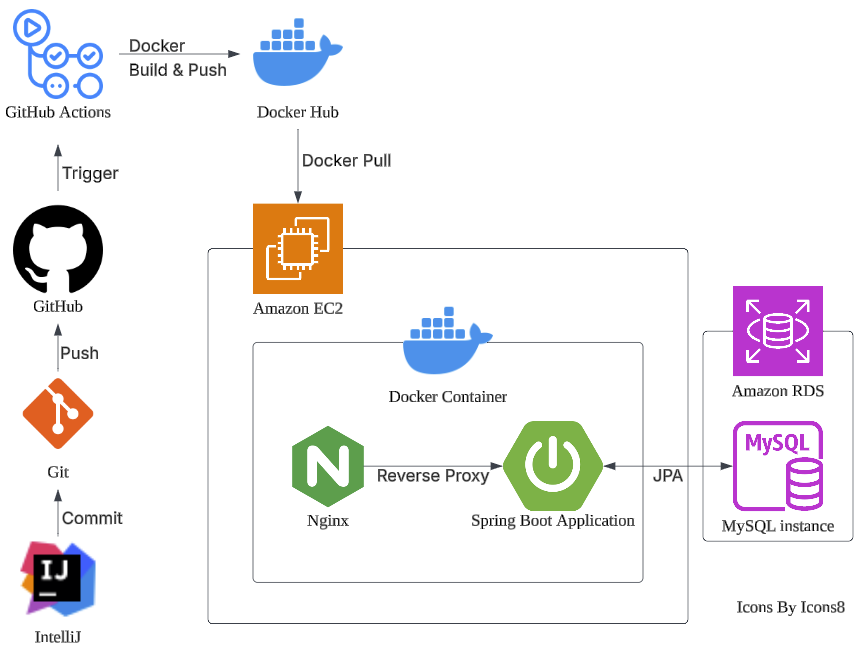

# 시스템 아키텍처

코드 작성 후, Git 저장소에 커밋한다.

GitHub로 push되면 GitHub Actions 트리거가 작동해서 애플리케이션을 빌드 및 테스트한다.

Docker 이미지를 빌드해서 Docker Hub에 push한다.

EC2 서버에서 이미지를 pull해서 Docker 컨테이너를 실행한다.

Nginx는 리버스 프록시 역할을 하고, 애플리케이션은 필요시 RDS(MySQL)에 데이터를 요청한다.

RDS는 처리 결과를 애플리케이션에 반환하고, 애플리케이션은 비즈니스 로직을 수행한 뒤 HTTP 응답 메시지를 생성해서 Nginx에 전달한다.

Nginx가 해당 응답을 클라이언트에게 반환한다.