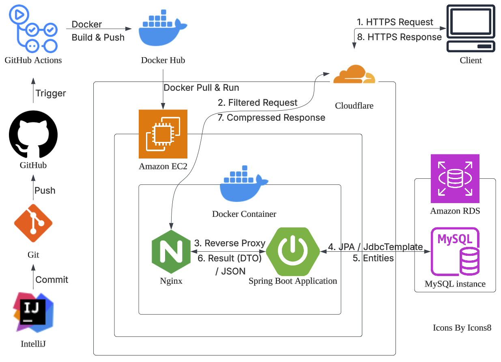

# 시스템 아키텍처

- CI/CD 흐름  
  1. Commit: IntelliJ에서 코드 작성 후, Git 저장소에 Commit 합니다.  
  2. Push: Git 저장소에서 GitHub로 Push 합니다.  
  3. Trigger: GitHub Actions가 Push를 감지하면, 빌드 및 배포 파이프라인을 시작합니다.  
  4. Docker Build & Push: 빌드된 결과물로 Docker 이미지를 생성하여 Docker Hub로 이미지 Push 합니다.  
  5. Docker Pull & Run: EC2 서버에서 이미지 Pull한 후, 기존 컨테이너를 교체하여 실행됩니다.

- 클라이언트 요청 흐름  
  1. HTTPS Request: 클라이언트가 도메인을 통해 요청을 보냅니다.  
  2. Filtered Request: Cloudflare가 DDoS 방어 및 WAF를 통해 안전한 요청만 필터링해서 전달합니다.  
  3. Reverse Proxy: Nginx가 요청을 받아 Spring Boot 애플리케이션으로 중계합니다.  
  4. JPA / JdbcTemplate: 애플리케이션이 DB에 필요한 데이터를 요청합니다.  
  5. Entities: DB가 데이터를 엔티티 객체로 변환하여 반환합니다.  
  6. Result (DTO) / JSON: 데이터를 Result DTO에 담아 JSON으로 직렬화합니다.
  7. Compressed Response: Nginx가 응답 데이터를 Gzip으로 압축합니다.
  8. HTTPS Response: 응답을 클라이언트 브라우저로 전달합니다.