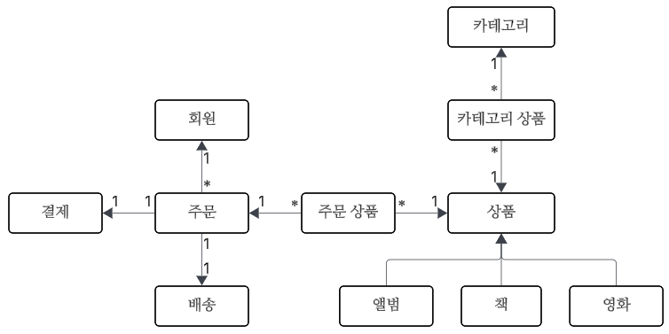
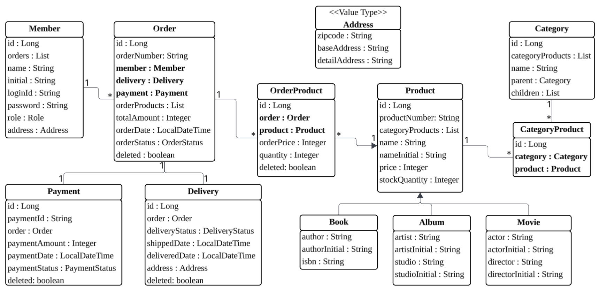

# 도메인 설계
## 도메인 관계도

회원은 상품을 주문할 수 있고, 주문은 결제하면 배송된다.

상품은 앨범, 책, 영화 3종류로 구성되고, 카테고리에 소속될 수 있다.

## 엔티티 설계

설계의 복잡성을 줄이기 위해, 단방향 매핑으로 설계했다. 이후에 필요할 시, 양방향 매핑으로 수정할 계획이다.

회원은 여러 번 주문할 수 있으므로, 주문이 다인 다대일 매핑이다.
주문과 배송, 결제는 한 주문에 한 번 일어나므로, 일대일 매핑이다.
주문과 상품이랑 상품과 카테고리는 다대다 매핑이므로, 각각 주문 상품, 카테고리 상품 엔티티를 추가해서 주문 상품, 카테고리 상품이 다인 다대일 매핑 2개로 연결했다.

회원과 배송은 값타입인 주소를 사용한다.

책, 앨범, 영화는 상품에 상속된 구조이다.

### 변경 이력
- 주문에서 주문 상품으로 양방향 매핑 추가

  주문 상품에 주문을 넣기 위해 추가

- 결제에서 주문으로 양방향 매핑 추가

  주문에 결제를 넣기 위해 추가

- 배송에서 배송 시작 시간, 배송 완료 시간 추가

  배송 시작 다음 날, 배송 완료 로직을 넣기 위해 추가