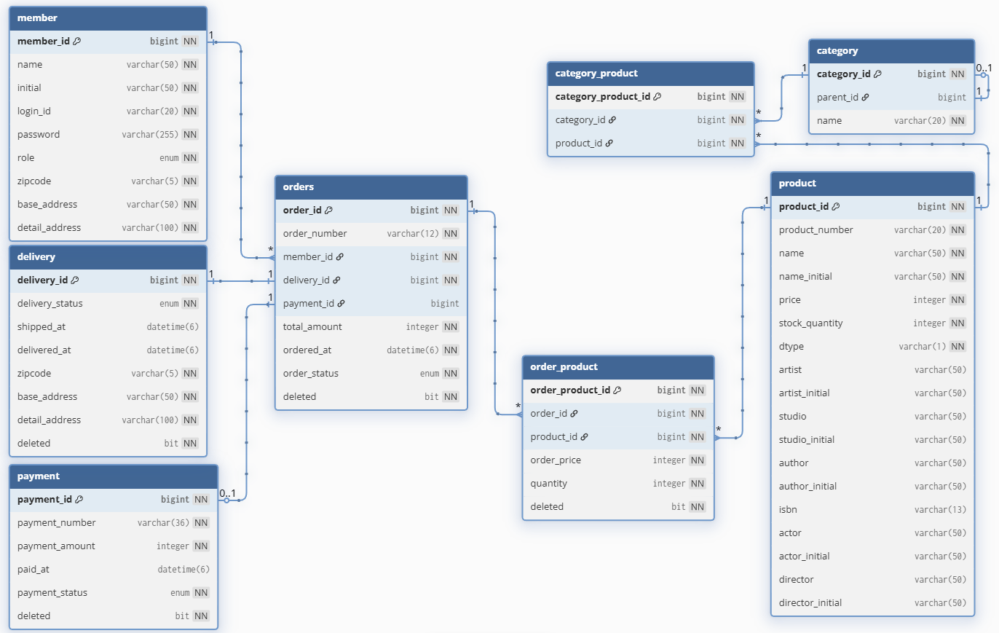

# ERD

외래키를 갖는 테이블이 연관관계의 주인이다.  
주문이 회원, 배송, 결제의 식별자를 외래키로 갖는다.  
주문 상품이 주문, 상품의 식별자를 외래키로 갖는다.  
카테고리 상품이 상품, 카테고리의 식별자를 외래키로 갖는다.  
상품에 상속된 엔티티 수가 적으므로, 단일 테이블 전략을 사용한다.  
카테고리는 자기 참조 외래키를 사용해 계층 구조를 표현한다.  

### 변경 이력
- 주문에서의 결제 아이디 null 허용  
  주문 생성하고 바로 결제를 진행하지 않는다.

- 배송에서 배송 시작 시간, 배송 완료 시간 추가

- 회원에서 등급 추가

- 결제에서 결제 번호 추가

- 결제 번호 이름을 paid_id -> payment_number으로 변경

- 주문에서 주문 번호 order_number로 추가

- 주문, 배송, 주문 상품에서 Soft Delete를 관리할 deleted 추가