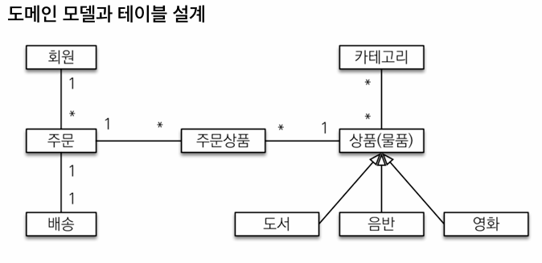
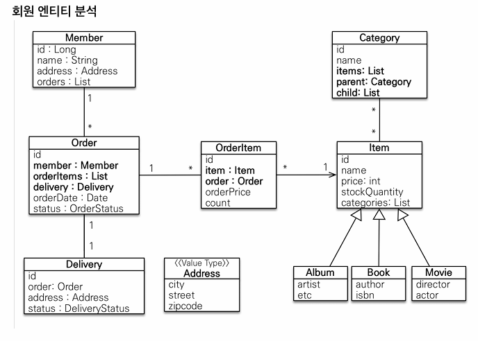
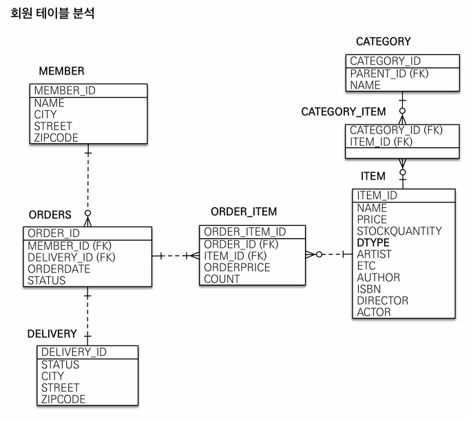
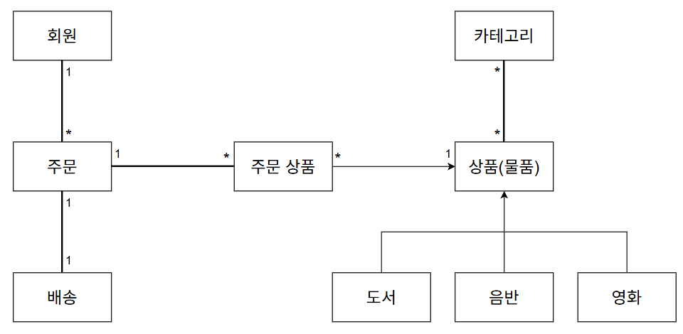
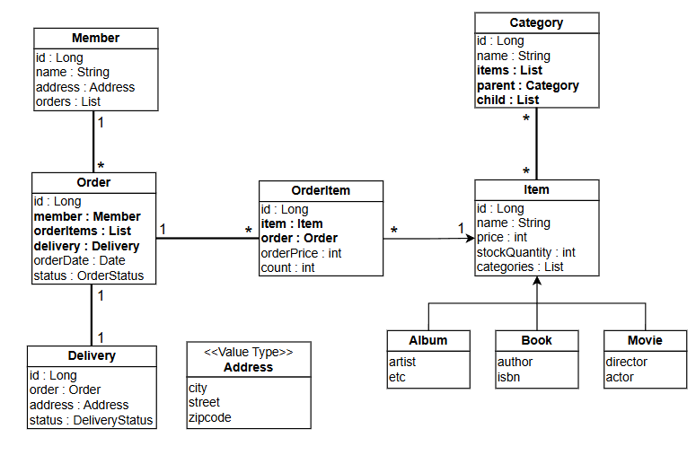
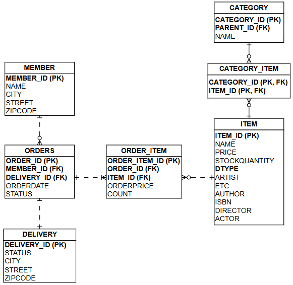

# 2일차 – 커머스 도메인 복습 + 초기 구조 초안
## 목표 : 교재 기반 설계를 그대로 그려보기
## 체크리스트
회원 / 주문 / 주문상품 / 배송 / 상품 / 카테고리 엔티티 목록 작성

연관관계 방향 표시

상품 상속 구조 다시 검토 (단일 테이블 vs 조인)

주문 생성 흐름 간단히 정리

산출물 : 간단한 ERD (엔티티와 속성, 개체 간 관계 그림으로 표현) 또는 텍스트 구조도

# 교재 예제

## 1. 도메인 모델 설계

회원은 여러 번의 주문을 할 수 있고, 주문이 회원을 참조하는 다대일 매핑이다.
한 번의 주문에 한 곳으로 배송되고, 주문이 배달을 참조하는 일대일 매핑이다.
주문과 상품은 다대다 매핑인데 주문 상품을 만들어서 일대다, 다대일 매핑으로 풀었다.
카테고리와 상품은 다대다 매핑이다.
도서, 음반, 영화는 상품이라는 공통 속성을 사용해서 상품에 상속된 구조이다.

공부용 예제여서 주문과 주문 상품은 일대다 매핑을 사용하고, 카테고리와 상품을 다대다 매핑을 사용했다.
일대다 매핑은 일이 연관관계의 주인이고, 다 쪽에 외래키가 있어서 일대다 매핑을 해야 한다면 다대일 양방향 매핑으로 사용하는 게 좋다.
다대다 매핑은 주문과 상품처럼 중간 엔티티를 만들어서 다대일 매핑 2개로 풀어내는 게 좋다.

## 2. 엔티티 분석

회원에서 주문 조회, 주문에서 회원 조회 기능이 필요해서 양방향 매핑이다.
주문에서 배달 조회, 배달에서 주문 조회 기능이 필요해서 양방향 매핑이다.
값 타입 Address를 만들어 회원과 배달에서 사용한다.
주문에서 주문 상품 조회, 주문 상품에서 주문 조회 기능이 필요해서 양방향 매핑이다.
주문 상품에서 상품 조회 기능이 필요하고, 상품에서 주문 상품 조회 기능이 필요 없어서 단방향 매핑이다.
아이템에서 카테고리 조회, 카테고리에서 아이템 조회 기능이 필요해서 양방향 매핑이다.
카테고리에서 parent와 child를 이용해서 계층 구조를 만들었다.

## 3. 테이블 분석

외래키를 갖는 쪽이 연관관계의 주인이다.

회원의 식별자와 배달의 식별자를 주문에서 외래키로 갖고, 주문의 식별자와 상품의 식별자를 주문 상품에서 외래키로 갖는다.
상품의 식별자와 카테고리의 식별자를 카테고리 상품에서 외래키로 갖는 동시에 식별자로 사용한다.

한 명의 회원에 0 ~ n개의 주문을 가질 수 있고, 1개의 주문에 1개의 배달과 1 ~ n개의 주문 상품이 있고, 1개의 상품에 0 ~ n개의 주문 상품과 카테고리 상품이 있고, 한 개의 카테고리에 0 ~ n개의 카테고리 상품이 있다.

## 4. 체크리스트 정리
- 상품 상속 구조 (단일 테이블 vs 조인)

  단일 테이블 전략은 조인이 필요 없어서 조회 쿼리가 단순하고, 자식 엔티티가 매핑한 컬럼은 모두 null을 허용하고, 단일 테이블에 모든 것을 저장해서 테이블이 커질 수 있다.

  조인 전략은 테이블이 정규화되어 있어서 저장공간이 효율적이고, 외래키 참조 무결성제약조건을 활용 가능하지만, 조회 시 조인을 많이 사용해서 조회 쿼리가 복잡하다.

- 주문 생성 흐름
  1. 엔티티 조회 (회원, 상품)
  2. 배송 정보 생성 (회원 주소)
  3. 주문 상품 생성 (상품, 상품 가격, 수량)
  4. 주문 생성 (회원, 배송, 주문 상품)
  5. 주문 저장