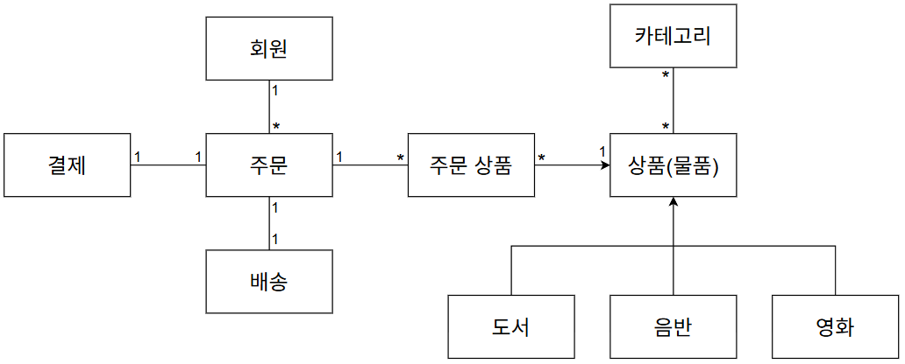
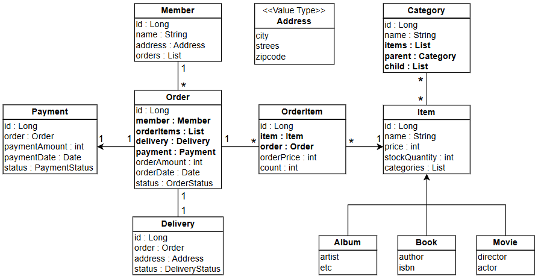
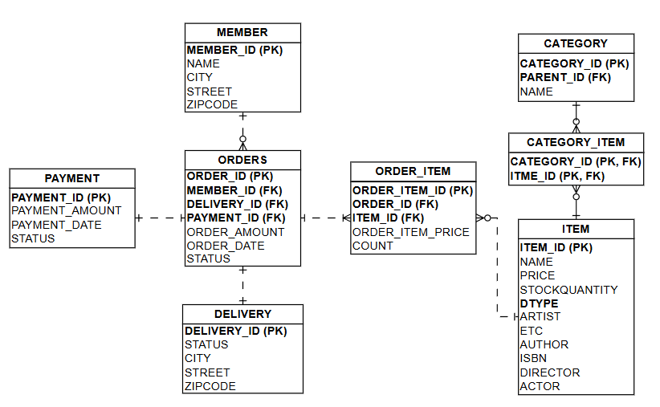

# 3일차 – 현실 문제 추가 설계 (설계만 해보기 나중에 최종 설계로 해도 됨)
## 목표 : 교재 설계에서 벗어나기 시작
## 체크리스트
주문 상태 세분화 (CREATED, PAID 등)  
결제 도메인 추가 여부 결정  
재고 차감 책임 위치 결정  
실패 시나리오 최소 2개 작성  
산출물 : 왜 이 개념을 추가했는지 문장으로 기록  

## 1. 도메인 모델 설계 - 결제 도메인 추가

결제를 추가해서 주문과 일대일 매핑을 했다.

## 2. 엔티티 분석 - 결제 엔티티 추가

주문에서 결제 조회 기능은 필요하고, 결제에서 주문 기능은 필요없어서 단방향 매핑을 했다.  
주문 엔티티에 주문 금액 속성을 추가했다.  
지금은 일대일 매핑이지만, 나중에 장바구니 기능을 추가하면 여러 주문을 한 번에 결제할 수 있어서 결제 금액과 주문 금액이 달라질 수 있어서 추가했다.

## 3. 테이블 분석 - 결제 테이블 추가

주문에서 결제의 식별자를 외래키로 받아 주문을 연관관계의 주인으로 설정했다.

## 4. 체크리스트 정리
- 결제 도메인 추가 여부  
  결제 도메인을 추가하면 외부 api를 사용하는 연습이 되고, 커머스의 완성도를 높이려면 결제가 필요하다.  
  다른 도메인을 더 추가하지 않은 이유는 여러 기능을 만드는 것보다 만드는 기능에서 오류를 없애는 것이 중요하기 때문에 결제 도메인만 추가했다.

- 주문 상태 세분화  
  주문 상태는 CREATED, PAID, SHIPPED, DELIVERED로 세분화한다.  
  결제 상태는 PENDING, FAILED, COMPLETED로 세분화한다.

- 실패 시나리오
  1. 재고 수량보다 주문 수량이 많은 경우  
     주문 생성 시, 재고 수량이 주문 수량보다 많으면 예외를 발생 시킨다.
  2. 결제 실패  
     결제 실패 시, 주문 상태를 주문 생성으로 유지시키고, 결제 상태를 결제 실패로 설정한다.

- 주문 / 결제 상태 흐름
  1. 주문 생성  
     주문 상태 : CREATED  
     결제 상태 : PENDING
  2. 결제
     - 결제 실패  
       주문 상태 : CREATED (유지)  
       결제 상태 : FAILED
     - 결제 성공  
       결제 상태 : COMPLETED (이후로 계속 결제 완료 상태 유지)  
       주문 상태 : PAID
  3. 배송 시작  
     주문 상태 : SHIPPED
  4. 배송 완료  
     주문 상태 : DELIVERED