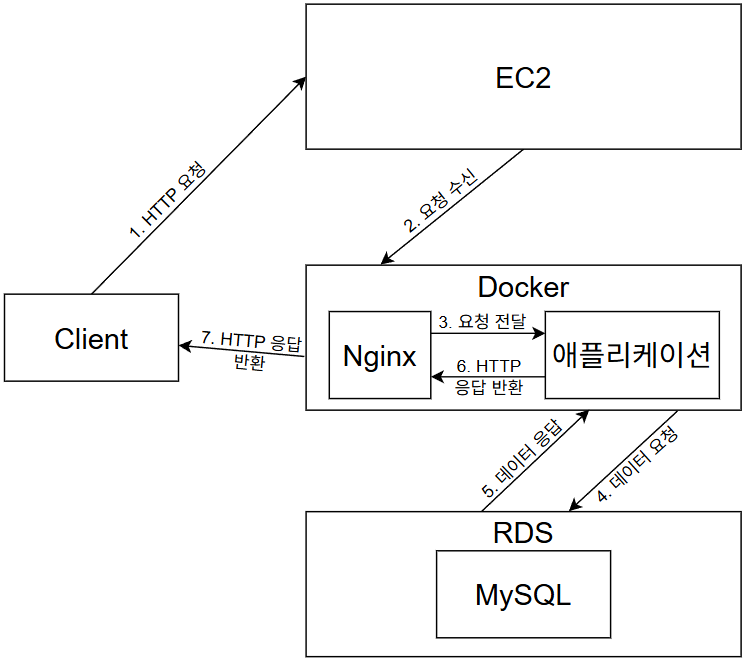

# 6일차 – 배포 흐름 미리 그려보기 (구현 x)
## 목표 : 전체 그림을 머릿속에 넣기
## 체크리스트
로컬 실행 흐름 정리  
Docker 컨테이너 실행 흐름 정리  
EC2 + Nginx + RDS 연결 흐름 그리기  
배포 중 예상 문제 3가지 적기  
산출물 : 간단한 아키텍처 그림 (손그림도 됨)

## 체크리스트 정리
- 로컬 실행 흐름
  1. Docker 컨테이너로 MySQL 실행
  2. IntelliJ에서 DB 연결 및 Spring, JPA 설정
  3. 코드 작성
  4. 테스트 (DB 연동, API 테스트)
  5. 애플리케이션 실행

- Docker 컨테이너 실행 흐름
  1. 애플리케이션을 Docker 이미지로 빌드
  2. Docker 레지스트리에 업로드
  3. EC2 서버에서 이미지를 pull
  4. Docker 컨테이너를 실행해서 애플리케이션 구동

- EC2 + Nginx + RDS 연결 흐름 그리기

  1. 클라이언트가 EC2 서버의 80 포트로 HTTP 요청
  2. EC2에서 실행 중인 Docker 컨테이너 안에 있는 Nginx가 HTTP 요청 수신
  3. Nginx는 리버스 프록시로 동작하고, HTTP 요청을 애플리케이션으로 전달
  4. 애플리케이션은 필요한 경우, RDS에 데이터 요청
  5. RDS는 조회 및 처리 결과를 애플리케이션에 반환
  6. 애플리케이션은 HTTP 응답 메시지를 만들어 Nginx에 반환
  7. Nginx가 HTTP 응답 메시지를 클라이언트에 반환

- 배포 중 예상 문제 3가지
  1. 로컬 환경과 Docker, EC2 환경의 설정 차이로 인해 오류가 발생할 수 있다.
  2. EC2 보안 그룹 설정을 잘못할 경우, 외부 접근으로 인한 보안 문제가 발생할 수 있다.
  3. EC2, Nginx, 애플리케이션, RDS의 접근 권한 설정으로 연동 문제가 발생할 수 있다.

### 참고 자료
- [Docker란?](https://docs.docker.com/get-started/docker-overview)
- [Spring Boot와 Nginx 연동](https://velog.io/@bjo6300/Springboot-docker-compose%EB%A5%BC-%EC%9D%B4%EC%9A%A9%ED%95%B4-springboot-nginx-%EC%97%B0%EB%8F%99%ED%95%98%EA%B8%B0)
- [EC2 보안 그룹 설정](https://velog.io/@wbsldj59/AWS-EC2-%EB%B3%B4%EC%95%88%EA%B7%B8%EB%A3%B9-%EC%84%A4%EC%A0%95)